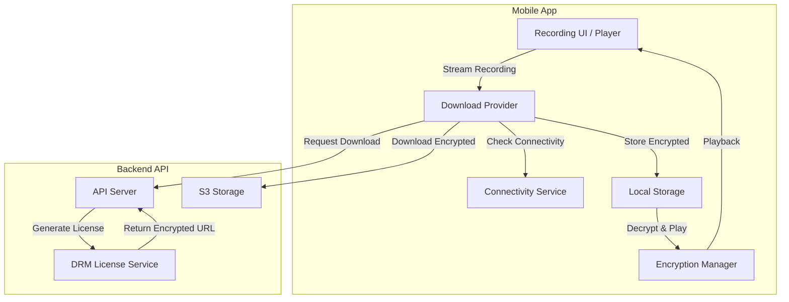
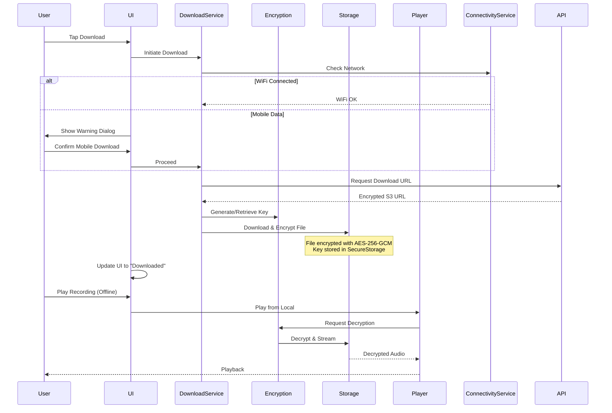

# Plan: Encrypted Recording Downloads for Volantis Live

## Overview

This plan outlines the implementation of a secure offline download system for recordings, similar to how Spotify, Netflix, and YouTube Music protect their downloaded content. The implementation will ensure that downloaded recordings can only be played within the Volantis Live application.

## Architecture Overview



## Implementation Todo List

### Phase 1: Core Infrastructure & Data Models

- [ ] **1.1** Update Recording model to add download-related fields:
  - `downloadUrl` - dedicated URL for downloading
  - `fileSizeBytes` - for displaying download size
  - `downloadExpiry` - optional expiration timestamp
  - `isDownloaded` - computed field
  - `localPath` - path to downloaded file
  - `downloadStatus` - enum: notDownloaded, downloading, downloaded, failed

- [ ] **1.2** Create download status enum and states:
  ```dart
  enum DownloadStatus {
    notDownloaded,
    queued,
    downloading,
    paused,
    downloaded,
    failed,
    expired,
  }
  ```

- [ ] **1.3** Create `RecordingDownload` model for tracking downloads:
  ```dart
  class RecordingDownload {
    final int recordingId;
    final String title;
    final String? thumbnailUrl;
    final String localPath;
    final String encryptedKey; // Stored in secure storage
    final int fileSizeBytes;
    final DateTime downloadedAt;
    final DateTime? expiresAt;
    final int lastPosition; // Resume playback position
  }
  ```

- [ ] **1.4** Extend `ApiConstants` with new download endpoints:
  - `/recordings/{id}/download` - get download URL
  - `/recordings/{id}/license` - get decryption license
  - `/recordings/downloaded` - list user's downloaded recordings
  - `/recordings/{id}/download/remove` - remove download from server tracking

### Phase 2: Encryption System

- [ ] **2.1** Create `EncryptionManager` service:
  - Generate device-bound encryption keys using AES-256
  - Store keys securely using `flutter_secure_storage`
  - Encrypt downloaded files before storing to local storage
  - Decrypt on-the-fly during playback
  - Key derivation: `AES-256-GCM` with device-unique key

- [ ] **2.2** Implement encryption workflow:
  ```
  1. User initiates download
  2. App requests encrypted download URL from server
  3. Server returns pre-encrypted content URL + license token
  4. App generates/retrieves device encryption key
  5. App downloads encrypted audio file
  6. App stores encryption key in secure storage (not with the file)
  7. App stores file path in local database (without the key)
  8. During playback: decrypt → decode → play
  ```

- [ ] **2.3** Add encryption utilities:
  - Use `encrypt` package or implement AES-256-GCM
  - Key generation using secure random
  - Secure key storage mapping (recordingId → key)

### Phase 3: Download Service

- [ ] **3.1** Create `RecordingDownloadsService`:
  - Handle download queue management
  - Implement pause/resume functionality
  - Track download progress
  - Manage download concurrency
  - Handle background downloads

- [ ] **3.2** Update `RecordingsService` with download methods:
  - `requestDownloadUrl(int recordingId)` - get signed download URL
  - `getDownloadLicense(int recordingId)` - get decryption key
  - `listDownloadedRecordings()` - get user's downloads
  - `removeDownload(int recordingId)` - remove from server tracking

- [ ] **3.3** Enhance `OfflineService` for recordings:
  - Add new table for recording downloads
  - Implement file encryption/decryption during storage
  - Add storage quota management
  - Implement automatic cleanup of expired downloads

### Phase 4: Connectivity & Network Handling

- [ ] **4.1** Create download preferences model:
  ```dart
  class DownloadPreferences {
    final DownloadQuality quality; // low, medium, high
    final bool downloadOverWifiOnly;
    final bool autoDownloadNew; // for subscribed channels
    final int? maxStorageGB; // storage limit
  }
  ```

- [ ] **4.2** Create download permission dialog:
  - Detect current connection type via `ConnectivityService`
  - Show warning when on mobile data
  - Provide WiFi-only option with cost-saving message
  - Remember user preference

- [ ] **4.3** Implement network-aware download manager:
  - Check WiFi before starting large downloads
  - Pause downloads when connection lost
  - Resume automatically when connection restored
  - Show connectivity status in download queue

### Phase 5: UI Components

- [ ] **5.1** Create download button component for recording cards:
  - States: download icon, downloading progress, downloaded checkmark
  - Tap to initiate download
  - Long press for download options (quality, delete)

- [ ] **5.2** Create download progress indicator:
  - Circular progress with percentage
  - Download speed indicator
  - Pause/Resume/Cancel controls
  - Estimated time remaining

- [ ] **5.3** Create "Downloads" section/tab:
  - List of downloaded recordings
  - Storage usage display
  - Manage downloads (delete, re-download)
  - Filter by: All, Downloaded, Downloading

- [ ] **5.4** Create download settings screen:
  - WiFi-only toggle (default: ON)
  - Download quality selection
  - Storage management
  - Auto-delete options

- [ ] **5.5** Update recording player for offline playback:
  - Detect if recording is downloaded
  - Play from local encrypted file when offline
  - Resume from saved position
  - Handle license expiration gracefully

### Phase 6: Background Downloads

- [ ] **6.1** Implement background download support:
  - Use `flutter_downloader` or native background tasks
  - Continue downloads when app is backgrounded
  - Show notification during download
  - Handle download completion notification

- [ ] **6.2** Create download notifications:
  - Progress notification during download
  - Completion notification
  - Error notification with retry option

### Phase 7: Security & Anti-Piracy

- [ ] **7.1** App-bound encryption:
  - Encryption key stored in `flutter_secure_storage`
  - Key is device-specific and not backed up to cloud
  - Key is tied to app installation

- [ ] **7.2** Content protection measures:
  - Encrypted files cannot be played by other apps
  - Files are not accessible via file manager
  - No direct file path exposure in UI
  - Add screen recording detection (optional)

- [ ] **7.3** License validation:
  - Validate license on each playback
  - Handle license expiration gracefully
  - Re-download if license expired but still has access

### Phase 8: Integration & Testing

- [ ] **8.1** Update `RecordingsProvider`:
  - Add download state management
  - Integrate download service
  - Handle offline playback detection

- [ ] **8.2** Update recording player:
  - Check for local download first
  - Fall back to streaming if not downloaded
  - Handle download expiry during playback

- [ ] **8.3** Add to navigation:
  - Downloads tab in main navigation
  - Download settings access

- [ ] **8.4** Testing scenarios:
  - Download over WiFi
  - Download over mobile (with warning)
  - Offline playback
  - Pause/resume downloads
  - Delete downloads
  - Storage limit handling
  - License expiration

## Mermaid: Download Flow



## Key Dependencies Required

Add to `pubspec.yaml`:

```yaml
dependencies:
  # Encryption
  encrypt: ^5.0.3          # AES encryption
  pointycastle: ^3.9.1     # Cryptographic algorithms
  
  # Background Downloads
  flutter_downloader: ^1.11.8
  workmanager: ^0.5.2      # Background task scheduling
  
  # File Management
  flutter_cache_manager: ^3.3.2  # Cache management
  permission_handler: ^11.3.1   # Storage permissions
  
  # Notifications
  flutter_local_notifications: ^17.2.4
```

## API Endpoints (Backend Requirements)

| Endpoint | Method | Description |
|----------|--------|-------------|
| `/recordings/{id}/download` | GET | Get signed download URL |
| `/recordings/{id}/license` | GET | Get decryption license |
| `/recordings/downloaded` | GET | List user's downloads |
| `/recordings/{id}/download/remove` | DELETE | Remove download |

## File Structure

```
lib/
├── features/
│   └── recordings/
│       ├── data/
│       │   ├── models/
│       │   │   ├── recording_model.dart      # Updated
│       │   │   └── recording_download.dart   # New
│       │   └── services/
│       │       └── recordings_service.dart  # Updated
│       └── presentation/
│           ├── providers/
│           │   └── recordings_provider.dart  # Updated
│           └── widgets/
│               ├── download_button.dart      # New
│               ├── download_progress.dart    # New
│               └── downloads_section.dart    # New
├── services/
│   ├── encryption_service.dart              # New
│   ├── download_manager.dart                 # New
│   └── offline_service.dart                 # Updated
└── core/
    └── constants/
        └── download_constants.dart           # New
```

## Summary

This plan implements a Spotify/Netflix-style protected download system that:

1. **Encrypts content at rest** - Files are encrypted using AES-256-GCM and can only be decrypted using keys stored in the app's secure storage
2. **Works offline** - Users can play downloaded recordings without internet
3. **Respects data costs** - Prompts users before mobile downloads, encourages WiFi
4. **Manages storage** - Tracks usage, allows cleanup, handles limits
5. **Provides great UX** - Progress indicators, background downloads, notifications
6. **Protects content** - App-bound encryption prevents playback outside the app
